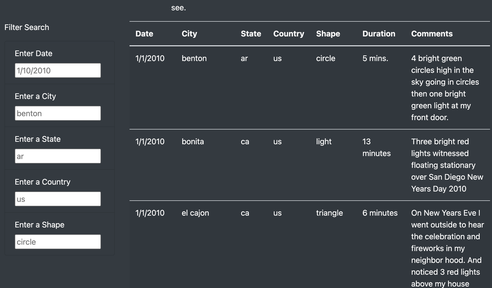

# UFOs
## Overview of Project
In this project, I created a webpage about UFOs. The webpage contains a table to organize UFO sightings data that is stored as a JavaScript array. The webpage contains five filter boxes to filter various elements of the data (ie. date, city, state, country, and shape of seen object). The user will interact with the table by entering certain criteria in the filter boxes and, upon pressing enter, the filtered table returns the requested data. I then used GitHub to host the webpage. 

The data in the table pertains to documented accounts of people witnessing UFO sightings. This webpage allows users to gain an in-depth analysis of UFO sightings by city, state, country, and shape of sighting. The idea is to let the user filter through all the facts and come up with their own understandings and realizations - Does life really exist on other worlds and, if so, are they visiting us today?

## Results
The webpage contains raw data that can be used to perform data analysis. We have an introduction which gives a summary to the user and introduces our interest in the subject. The webpage is clear and displays in an easy to read format. It has a catchy title and cool looking image. The filter boxes are easy to use and simple to understand. Here is a screenshot of the filter boxes: 

The functionality of the webpage comes in the use of the filters for the table. The user will simply fill in the corresponding box to which they will be exploring further data. They will use the example provided to understand the formatting inside the filter boxes. Once the parameter is filled-in, the user will simply press Enter on their keyboard and the results will be displayed. The following example is a user inputing the state filter box to search for all sightings in Wisconsin. 

## Summary
All-in-all, the webpage works and looks great. It is accessible and interesting. One drawback of this webpage is that it is static. So, as new data comes in, it can not be updated, displayed or used automatically. Users can only perform analysis on the displayed data. 

- One additional recommendation for further development is to allow users to input their own experiences and save them in the data table. This method will allow for a central location to store this potentially vast amount of information. And, as such, will allow for easier analysis and filtering. 

- A second recommendation is to create links to other news articles, resources, websites, and any other various sorts of information that pertain to UFO sightings. This would allow greater research capabilities and user friendliness.  
